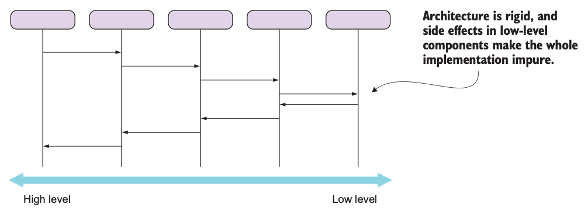

# Function Composition

In mathematics, there is a concept of function composition:

`h = f · g`

It basically means the following:

`h(x) = f(g(x))`

We apply function `f(x)` on a result of `g(x)`.

This is also a popular approach in functional programming.

```csharp
var person = new Person("John", "Smith");
var email = AppendDomain(GenerateUsername(person));
```

This syntax is not the most readable since the operations are reversed in code.
Another way is to use extension methods:

```csharp
var email = person.GenerateUsername().AppendDomain();
```

The order of operations is in the correct order.
Our program is an implementation of some data flow.

::: tip Extension Methods
In FP, it's popular to use extension methods instead of class methods (OOP). It
is due to the desire to separate data from the functions that operate on that
data.
:::

## Elevated Values

When dealing with the higher abstraction of elevated values, `Map` should be used:

```csharp
var opt = Some(new Person("John", "Smith"));
var emailOpt = opt.Map(GenerateUsername)
                  .Map(AppendDomain);
```

## Reusability

Function should be generic, to be reusable. Here's an example:

```csharp
// SPECIFIC
static decimal AverageEarningsOfRichestQuartile(this IEnumerable<Person> people) =>
    people
        .OrderByDescending(p => p.Earnings)
        .Take(people.Count / 4)
        .Select(p => p.Earnings)
        .Average();


// GENERIC
static IEnumarable<Person> RichestQuarter(this IEnumarable<Person> people) =>
    people
        .OrderByDescending(p => p.Earnings)
        .Take(people.Count / 4);

static decimal AverageEarnings(this IEnumarable<Person> people) => {
    people
        .Select(p => p.Earnings)
        .Average();
}

var averageEarningsOfRichestQuartile = people.RichestQuarter().AverageEarnings();
```

## Layering

Often, our programs look as follows:



In FP, it should look more like this:


This way, the entire workflow is available in the top-level component and it's
more clear what the code actually does.

In the first image, the architecture is very rigid and difficult to change.