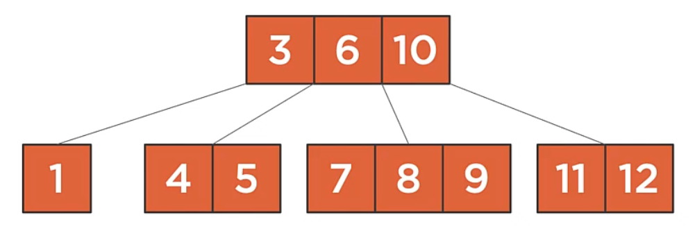

# Trees

- **Dimension** - maximum amount of children a tree node can have (e.g. binary
  tree - max 2 children)
- **Height** of a node - amount of levels from the lowest leaf to that node.
- **Level** of a node - tree layers up to that node from the root. The root is
  at level 1.

## Binary Tree

A very popular kind of tree is a binary tree, where the dimension parameter
equals 2.

### Binary Search Tree

A binary tree where children with a lesser value are placed on the left, and the
children with greater or equal values are placed on the right.

This tree is well known for the **Binary Search** algorithm that can be applied
to it (and to sorted arrays).

Characteristics:

- the smallest value will be the leaf node on the far left
- the greatest value will be the leaf node on the far right
- the tree is **Balanced** when:
    - the right and left side of the root has rougly the same amount of nodes
    - the height of all leaves is rougly the same
- the **Unbalanced** tree, in the worst case scenario is like a linked list

#### Complexity

- **Insertion**: O(log n) (average); O(n) (worst case, when the tree is highly
unbalanced)
- **Traversal**: O(n)
- **Lookup**: O(log n) (average); O(n) (worst case, when the tree is highly
unbalanced)
- **Removal**: O(log n) (average); O(n) (worst case, when the tree is highly
unbalanced)

#### AVL

AVL trees are binary search trees that are self-balancing, keeping the **Balance
Factor** at maximum 1 at all times.

::: tip Balance Factor
The **Balance Factor** is the difference between the right and left children on
the root node.
:::

### Traversal

#### Pre-order

The parent first, then the children.

Use-cases:

- creating a copy of a tree (with exactly the same placement of nodes)

#### In-order

The left child is first, then the node, then the right child.

Use-cases:

- sorting elements in the increasing order (must be search tree)

#### Post-order

The left and right children are first, then the parent node.

Use-cases:

- deleting all nodes of the tree (since we always deal with children first, then
  the parent)

## B-Tree

Characteristics:

- A node can have multiple values
- A node can have multiple children
- The children are between the values of the node
- the tree has to be sorted
- For *n* values in a node, that node can have *n+1* children
- **Minimal Degree (T)**
  - every non-root node has to have at least *T* children and max *2T* children
  - every non-root node has to have at least *T-1* values and max *2T-1* values
  - A node with *T* children and *T-1* values is called a **Minimal Node**
  - a node with *2T* children and *2T-1* values is a **Full Node**
- All leaf nodes should have the same height
- Values can only be added to the leaf nodes

An example of a tree that is not B-Tree:

The node "1" does not have enough values (should have at least 2).

## Heap

A tree structure where either:

- all children are smaller than or equal to the parent (**Max-heap**)
- all chidren are greater than or equal to the parent (**Min-heap**)

Thanks to the above (**Heap Property**) finding min or max value (depending on
a type of heap) is a O(1) operation.

Additionlly:

- The tree must be complete - before starting a new level, the current level
  needs to be full
- Heap can be stored in an array. We just continuously add the nodes from each
  level