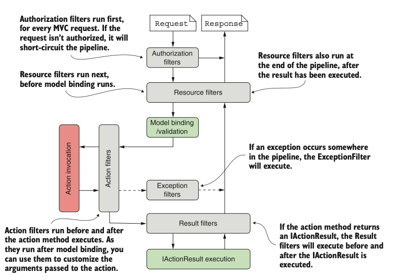

# Filters in ASP.NET Core

Filters act as a pipeline, similarly to middleware. They can be used both with
MVC and Razor Pages. They can be applied to individual controllers, actions or
globally, to all of them. Filters run as part of Endpoint middleware.

## Comparison with the Middleware

Filters is like a small middleware. It hooks into the lifecycle of a
request-response procedure.

Differences:

- Middleware runs for ALL requests, filters run for selected requests (or
  globally as well).
- Filters have access to `HttpContext` and MVC constructs such as `ModelState`
  and `IActionResult`. Middleware has access only to `HttpContext`.

Middleware is more general and it's designed to solve concerns that are
cross-cutting throughout the app.

::: tip
Use the middleware if the code we want to write is happy with the information
provided by the `HttpContext` and if the code should apply to all requests.
:::

## Types

There are 5 types of filters, each one running at a different stage (MVC):

- **Authorization** (request only) - short-circuits the request if it's unauthorized
- **Resource** (2-ways) - they can have many use-cases, depending on needs. It
    runs before model binding.
- **Action** (2-ways) - runs after model binding. We can manipulate action's
    arguments; or they can modify action's response
- **Exception** - catch exceptions allowing us to prepare a better response. It catches exceptions in:
    - model binding and validation
    - actions execution
    - action/page filter execution
- **Result** (2-way) - run before and after `IActionResult` is executed, we can
    control that execution within a filter.

::: tip Razor Pages
The difference in Razor Pages is that the **Action Filter** is called
**Page Filter**. The Page Filters run 3 times:

- after page handler selection - before binding and validation; we can't
short-circuit at this point
- after model binding - we can modify the model-bound data; we can short-circuit
- after page handler execution - we can modify the `IActionResult`
:::

Filters registered globally will be executed for both MVC and Razor Pages.

::: tip Result
If we short-circuit the Action/Page filter, the Result filter will still be
executed!
:::



## Implementation

Non-global filters are implemented as attributes. The order of attributes
application dictates the order of filters execution.

Filters can be sync or async. Each filter type has two interfaces for that reason.
For example, the Authorization filter has:

- `IAuthorizationFilter`
- `IAsyncAuthorizationFilter`

::: warning
Only one of the interfaces should get implemented. If we implement both, the
*async* one will be executed anyway.
:::

The synchronous filters that execute multiple times (twice or 3 times) have
separate methods in their interface for each of the executions. The asynchronous
ones have one method and delegates that we need to execute between
request/response operations.

Here's an example of a synchronous filter:

```csharp
public class LogResourceFilter : Attribute, IResourceFilter
{
    // Request
    public void OnResourceExecuting(ResourceExecutingContext context)
    {
        Console.WriteLine("My sync Resource filter (executing)");
    }

    // Response
    public void OnResourceExecuted(ResourceExecutedContext context)
    {
        Console.WriteLine("My sync Resource filter (executed)");
    }
}
```

Here's an example of an asynchronous filter: 

```csharp
public class AsyncLogResourceFilter : Attribute, IAsyncResourceFilter
{
    public async Task OnResourceExecutionAsync(
        ResourceExecutingContext context, ResourceExecutionDelegate next)
    {
        Console.WriteLine("My async Resource filter (executing)");

        var executedContext = await next();
        
        Console.WriteLine("My async Resource filter (executed)");
    }
}
```

::: tip Short-circuiting
To short-circuit a request we need to set the `context.Result` property with
some `IActionResult`.
:::

::: tip ControllerBase
The `ControllerBase` class implements `IActionFilter` and `IAsyncActionFilter`.
If we need an Action filter for a single controller we can just override
controller's methods of that filter and they will be executed for every action.
:::

## Application

Filters can be applied:

- globally
- to MVC:
    - controllers
    - actions
- to Razor Pages
    - `PageModel` (not individual methods)

### Global

Both MVC and Razor Pages:

```csharp
builder.Services.AddControllers(options =>
{
    options.Filters.Add<LogResourceFilter>();
});
```

Just the Razor Pages:

```csharp
builder.Services.AddRazorPages()
    .AddMvcOptions(options =>
    {
        options.Filters.Add<LogResourceFilter>();
    });
```

### MVC

```csharp
[ApiController]
[LogResourceFilter]
[Route("[controller]")]
public class WeatherForecastController : ControllerBase
{
    [HttpGet("/")]
    public void Get()
    {
        return Ok();
    }
    
    [LogResourceFilter2]
    [HttpGet("/other")]
    public void GetOther()
    {
        return Ok();
    }
}
```

### Page Model

```csharp
[LogResourceFilter]
public class PrivacyModel : PageModel
{
    public void OnGet()
    {
    }
}
```

### Order

Filters are executed in the following order for a request:

1. global filters
2. controller filters
3. base controller filters
4. action filters

::: warning Request and Response
The list above is reversed when the RESPONSE travels through the pipeline
(`*Executed` methods).
:::

::: tip Atributes Order
The order of attributes application on an entity is respected in execution.
:::

#### IOrderFilter

We can change the default order of execution by implementing the `IOrderFilter`
interface, which has just one property - `int Order`. Lower value of `Order`
moves filter up in the queue. Filters with the same `Order` execute using the
framework's ordering rules, presented before.

::: tip
Filters that do not implement `IOrderFilter` are assumer to have `Order = 0`.
:::

## Dependency Injection

Since filters are attributes (unless global), it's not easy to inject services
into them. Filters are singletons. One approach would be to use the *service
locator* pattern, but nobody likes that.

Instead, a filter could be split into two classes:

- one implementing the `I*Filter` - it would contain the DI and filter
  functionality
- another one implementing either `TypeFilterAttribute` or
  `SerivceFilterAttribute`.

The solution is based on `IFilterFactory` that ASP.NET Core "understands" and it
knows how to handle it.